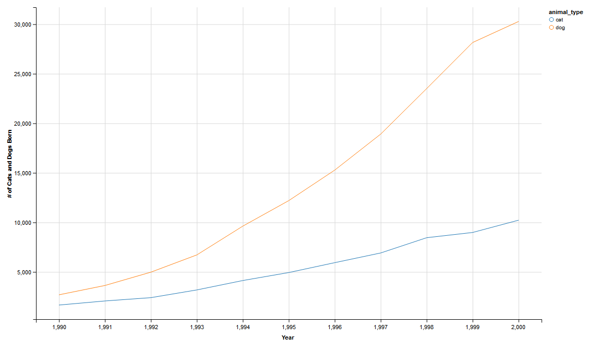

Visualizing Louisville's Cat's and Dog's
========================================================
date: 11/20/2015
width: 1440
height: 1000
font-family: 'Helvetica'
transition: none
transition-speed: fast

Overview
========================================================
incremental: true
This Shiny application allows one to easily see what breeds of cats and dogs have
been popular through the years in Louisville.  Using the app, one can see:

* Number of animals born/registered per year by breed
* Overall number of cats and dogs through the years
* Popularity of breed within a select period of time

<small>Link: [https://adamt.shinyapps.io/animals_app](https://adamt.shinyapps.io/animals_app)</small>

The apps ease of use allows the user to sift through over half a million records with 
the click of a button and quickly display information about their furry friend.

Data Set
========================================================

The raw data for this project can be found at Louisville's open data website.
* http://portal.louisvilleky.gov/dataset/animaltag-data

After processing the data, I am left with the following: 


```r
head(data, n = 3)
```

```
  animal_type sex        dob breed_group primary_breed year
1         cat   M 2012-09-10   shorthair   domestic sh 2012
2         dog   N 2008-09-10         toy       maltese 2008
3         dog   N 2008-09-10         toy       maltese 2008
```

========================================================
Using the app, you are able to render plots like the following.


```r
data %>%
  group_by(year, animal_type)%>%
  summarise(count = n())%>%
  filter(year >=1990 & year <= 2000)%>%
  ggvis(~year,~count, stroke = ~animal_type)%>% layer_lines()%>%
  add_axis("x", title = "Year")%>%
  add_axis("y", title_offset = 50, title = "# of Cats and Dogs Born")
```


Areas for Further Work and Extending Product Usability
========================================================
This app demonstrates the basic functionality of the idea.  Visualization can be 
extended to compare selected breeds, popular animal colors, popular times of year to 
get pets, etc.  With the rich data set at our fingertips, this app is full of potential.

Additionally, app usability can be improved by adding interactive tooltips or additional
pages displaying useful information about the data in the plots.

